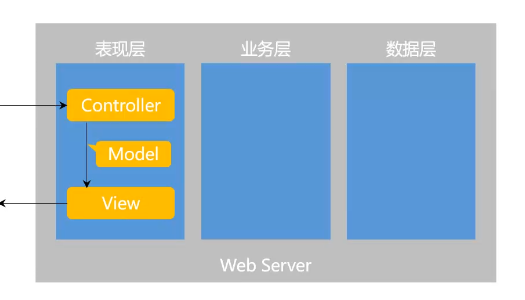
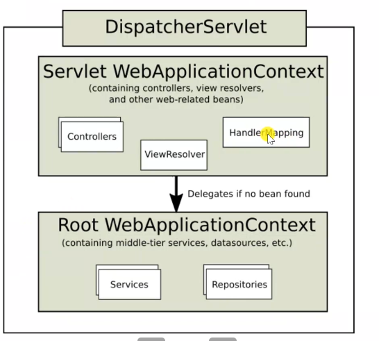
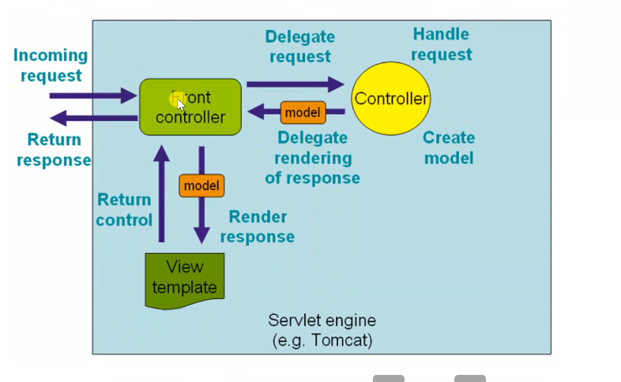
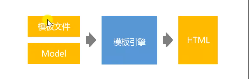

# Spring

## Spring IOC

- Inversion of Control
  - 控制反转，是一种面向对象变成的设计思想
- Dependency Injection
  - 依赖注入，是IOC思想的实现方式
- IOC Container
  - IOC容器，是实现依赖注入的关键，本质上是一个工厂
  - 需要给它**bean的类型**和**配置文件**

### 管理Bean的创建

- 在bean上加@Component注解即可

```java
@SpringBootApplication
# 这个注解标识的类代表类是配置文件
public class CommunityApplication {

	public static void main(String[] args) {
		
		SpringApplication.run(CommunityApplication.class, args);
	}

}
# 在web项目中这个语句会自动创建IOC Container的
# 创建后会自动扫描bean并装配到容器里
# @ComponentScan会扫描这个所在包中带@Component的类
    @Service
    @Controller
    @Repository
    @Component
    上述几个都有@Conponent注解的
```

```java
# 类实现implements ApplicationContextAware接口
@Override
	public void setApplicationContext(ApplicationContext applicationContext) throws BeansException {
		this.applicationContext = applicationContext;
	}
# 覆盖这个方法
AlphaDao alphaDao = applicationContext.getBean(AlphaDao.class);
# 面向接口编程，这样就可以调用了
```

```jav
# 当想要使用其他AlphaDao的实现类bean的时候
# 在这个实现类中
@Primary
#就可以优先扫描
```

### bean的初始化和销毁

- 被spring管理的Bean默认单例，也就是只会实例化一次

  - 要想能够多次实例化+ @Scope("prototype")

- ```
      @PreDestroy
      //在销毁之前调用
      public void destory(){
          System.out.println("销毁");
      }
  ```

- ```
      @PostConstruct
      //在构造之后调用
      public void init(){
          System.out.println("初始化");
      }
  ```

- 但是当使用jar包，不能该源码时

  1. 配置类装配第三方bean

  2. ```
     @Bean
     public SimpleDateFormat simpleDateFormat(){
         return new SimpleDateFormat("yyyy-MM-dd HH:mm:ss");
     }
     //此方法返回的对象将被装配到Bean里
     //Bean名称就是方法名
     ```

### Bean实际使用

- 一般不会像前面那样直接主动获取

- 一般自动注入

  ```java
  	@Autowired //自动注入
  	@Qualifier("alpha_h") //指定名称，如果alphaDao有多个实现类的话
  	private AlphaDao alphaDao;
  
  ```

## Spring MVC架构

- **HTTP**   [http](https://developer.mozilla.org/zh-CN/docs/Web/HTTP)
  - 超文本传输协议



- 三层架构

  - 表现层
  - 业务层
  - 数据访问层

- MVC

  - Model:模型层
  - View:视图层
  - Controller控制层
  - 主要解决表现层的问题
  - 浏览器的访问到达Controller层，然后Controller层调用业务层处理，
  - 将数据封装到Model层，View利用这个model层进行渲染显示

- 核心组件

  - 前端控制器：DispatcherServlet
  - 

  

  > DispatcherServlet先找Controller，匹配后操作，返回MODEL,将model给VIEW,返回前端控制器，这样就可以了。

  - 实际编码不需要管前端控制器
  - 只需要编码MVC

### 模板引擎

- thymeleaf
  - 利用Model数据生成动态html
- 
- thymelef倡导以HTML文件为模板
- 常用语法
  1. 标准表达式
  2. 判断与循环
  3. 模板的布局

### 获取请求响应对象

```java
@RequestParam(name = "current",required = false,defaultValue = 1) int current)
```

```java
@PathVarible("id" int id)
//这个获取路径中的数据
```

- 响应html数据
  - 默认的HTML,return modelandview或者路径
  - 加了@ResponseBody就返回字符串或者JSON

# Mybatis

## 核心组件

- SqlSessionFactory: 用于创建SqlSession的工厂类
- SqlSession:Mybatis的核心组件，用于向数据库执行SQL
- 主配置文件：XML配置文件，可以对Mybatis的底层行为做出详细的配置
- Mapper接口：DAO接口，在Mybatis中习惯称为Mapper
- Mapper映射器：编写SQL,并将**SQL和实体类映射的组件**
  - 采用XML，注解实现


# Mybatis-Spring

```JAVA
@Mapper  标识bean
```

> entity.java ----- 对应类和数据库表
>
> Dao---Mapper.java ---------写出增删改查的接口---与数据库打交道
>
> mapper.xml-----------实现接口
>
> service.java----调用Mapper
>
> controller.java-------调用service.java

----------

# 请求的流程

Controller--->Service --->Dao----->DB

--------

**开发tips:**

1. 拆解

-----

# 项目调试技巧

1. 后端打断点
2. 前端console
3. 前端sources.js 里面


# Mapper实现

1. XML

   - 

2. 注解

   ```java
   @Insert({})
   @Update({})
   @Select({})
   @Delete({})
   //注意别写错了，不报错的这个
   ```

   

# 拦截器

[拦截器](https://www.cnblogs.com/zktww/p/11550891.html)

1. 先写类
   - 重写方法
2. 然后配置类
   - 继承WebMvcConfigurer
3. 编写拦截器配置文件类并继承 WebMvcConfigurer类，并重写其中的方法 addInterceptors并且在主类上加上注解 @Configuration
3. 不登录不让访问
3. 登录给hostholder


# 事务管理

## @Transaction

## transactionTemplate


> 防止功能需求和系统需求耦合起来
>
> 系统需求，记录日志
>
> 功能需求，service等
>
> 为了减少改动，使用统一记录日志
>
> AOP技术

# 统一处理异常

1. 在表现层统一处理异常
2. Spring Boot，只要在特定路径下，加上特定页面，出现异常会自动跳转页面
3. 404 500
4. @ControllerAdvice
   - 用于修饰类，表示该类是Controller的全局配置类

# 统一记录日志

## AOP

1. Aspect Oriented Programing
2. 面向方面/切面编程
3. AOP是一种编程思想，是对OOP的补充，可以进一步提高编程的效率

- 不同模块有同样需求，就使用AOP就行
- 不需在业务组件去调用
- 看起来横跨多个组件，就是面向切面编程

### 术语

1. 业务组件Bean叫target
2. 把代码单独封装到组件里的组件叫aspect，叫方面/切面
   - 声明切点
   - advice:具体系统逻辑
3. 编程过程完全面向切面
4. 如何切面织入target
5. 织入时机
   - 编译时织入
   - 装载时织入，
   - 运行时织入，需为目标生成代理对象
6. 连接点：joinpoint
   - 属性
   - 静态块
   - 成员方法
   - 等

### 实现

- **AspectJ**
  - 扩展了java语言
  - 在编译期织入代码
- **Spring AOP**
  - 纯java实现
  - 在运行时通过代理的方式织入代码
  - 只支持方法类型的连接点

### Spring AOP

- JDK动态代理
  - 接口，实现类
  - 生成接口的代理类代理原始类
- CGLib动态代理
  - 通过子类代理


# Redis

> 一站式高**性能**存储方案

- 入门

  - 是一款基于键值对的NoSQL数据库，**键都是string, 值支持多种数据结构**

  - 字符串，哈希，列表，集合，有序集合等

  - 将所有的数据都存放在**内存**中

  - 将内存中的数据以**快照或日志**的形式保存在硬盘上，来保证数据的安全性

    - 快照不适合实时做，适合**做备份**
    - 日志，存命令，较快，**实时存储**，追加存储，较占空间，恢复速度较慢，

  - 应用场景

    - 频繁修改，访问的。

    - 缓存
    - 排行榜
    - 计数器
    - 社交网络
    - 消息队列

- 编程式事务

  - 中间不能查询
  - 不是不能查询，是返回的结果不大一样


## 收获

1. 写配置项的重要性
1. 容器的好处：面向接口，只用写接口，后续有改动可以容易更改


